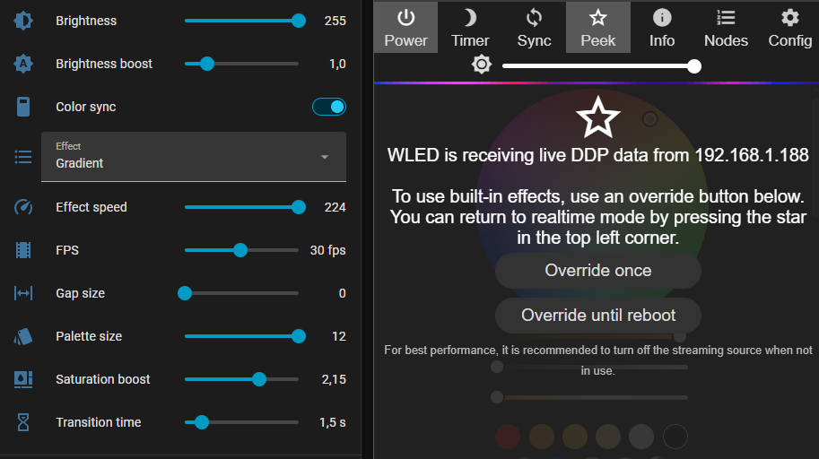

# WLED Media Color Sync for Home Assistant

Pull the main colors out of a picture (album art, an `image` entity, a camera
snapshot, a URL or a local file) and stream them **in real time over UDP** to a
WLED device, rendered with animated effects and gap spacing.

<p align="center" width="100%">
    
</p>
<p align="center" width="100%">
    
</p>

## Features

- **Setupless Setup:** Just type in your WLED IP or hostname! The integration auto-detects your strip's LED count via WLED's API and sets up DDP protocol automatically.
- **Dynamic Control Sliders (100% Live):** Adjust Brightness, Effect Speed, Palette Size (1–12), Gap Size (0–20), Saturation Boost (0.5–3.0), Brightness Boost (0.5–3.0), Transition Time (0–10s), and FPS (1–60) live on your dashboard without reopening setup dialogs.
- **Smart palette extraction (1–12 main colors):** each color is scored by how much of the picture
  it covers, how saturated it is and how bright it is. That stops black
  backgrounds from taking over. Near-duplicate colors are merged, then
  saturation and brightness get a boost so the colors look right on LEDs.
- **Palette Picture Output:** Automatically generates a `32px` high by `(32px * palette_size)` wide PNG image containing the detected colors left to right as 32x32px blocks.
- **Gap Mode:** Insert configurable black / OFF LEDs between colors evenly across strip segments, moving chase blocks, or custom patterns.
- **UDP protocols:** DDP (default, port 4048), DRGB (switches to DNRGB
  automatically on strips longer than 490 LEDs), DRGBW and WARLS (port 21324).
- **Effects:** Solid, Gradient, Segments, Ambient drift, Chase/flow, Twinkle, Breathe, and Gap blocks.
- **Smooth crossfade** when the song or picture changes.
- **Auto pause:** when the media player goes idle or off, streaming stops and
  WLED returns to its normal state.
- **Entities created per device:**
  - `switch` Color sync
  - `select` Effect
  - `number` **Brightness**, **Effect speed**, **Palette size** (1–12), **Gap size** (0–20), **Saturation boost** (0.5–3.0), **Brightness boost** (0.5–3.0), **Transition time** (0–10s), and **FPS** (1–60)
  - `sensor` Dominant color (with full palette attributes)
  - `sensor` **Color 1** through **Color 12** (individual numbered hex & RGB palette sensors)
  - `image` **Palette picture** (`image.wled_palette_picture`, a 32x[32*N] px image of the extracted colors left to right)

## Installation (HACS)

1. HACS → ⋮ → *Custom repositories* → add `https://github.com/piiotre/ha-media-2-wled` as type **Integration**.
2. Install **WLED Media Color Sync** and restart Home Assistant.
3. *Settings → Devices & Services → Add Integration → WLED Media Color Sync*.

Manual install: copy `custom_components/wled_color_sync` into your `config/custom_components/` folder.

## Setup

| Field | Notes |
|---|---|
| Host | IP address or hostname of the WLED device |
| Picture source | media_player / image / camera entity (optional, can also be passed in services) |

> In WLED, check that *Settings → Sync Interfaces → Realtime → Receive UDP realtime* is enabled.

## Services

### `wled_color_sync.sync_image`
Pushes the colors of any image to a device once. Returns the palette.

```yaml
action: wled_color_sync.sync_image
data:
  config_entry_id: 0123456789abcdef
  source: camera.front_door
```

### `wled_color_sync.extract_colors`
Only returns the palette; it doesn't touch any lights.

```yaml
action: wled_color_sync.extract_colors
data:
  source: media_player.spotify
  palette_size: 8
response_variable: result
# result.colors -> ["#e43f2a", "#1f6fd1", "#f2c14e", ...]
```
